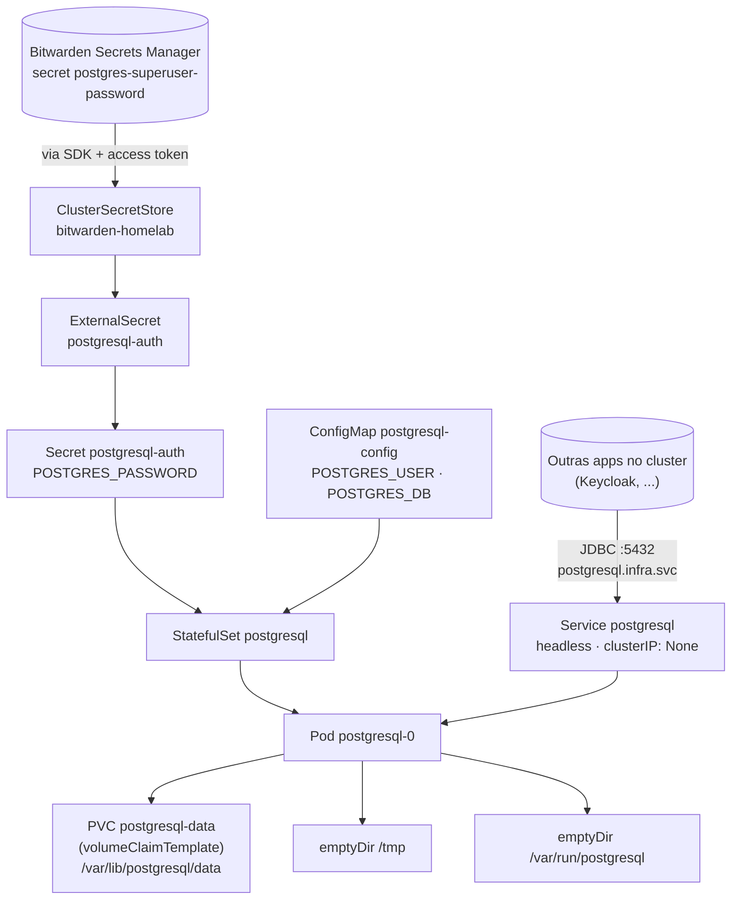

# Architecture — deploy-postgresql

> **Escopo: laboratório, não produção.** Banco de dados em container
> não é recomendado em produção — lifecycle de Pod (restart, eviction,
> reschedule) não combina com state que precisa de durabilidade,
> backup testado e replicação. Em produção real, o caminho são serviços
> gerenciados de DB. Aqui o objetivo é demonstrar os primitives
> (StatefulSet, VCT, ESO, security context).

## Overview

PostgreSQL como **StatefulSet single-replica** no k3s do homelab. Serve
de banco único compartilhado pelas demais apps (Keycloak, futuras
workloads). Estrutura kustomize em `k8s/base/` + overlays
(`overlays/dev`, `overlays/prod`).

Config dividida entre ConfigMap (`POSTGRES_USER`, `POSTGRES_DB`) e
Secret materializado via External Secrets a partir do Bitwarden Secrets
Manager. Persistência via `volumeClaimTemplates` no StatefulSet —
storage class default do k3s (`local-path`).

Para "como aplicar" e validação, ver [README.md](README.md).

---

## Render e mounts

Postgres precisa escrever em 3 paths: `/var/lib/postgresql/data`
(PVC persistente), `/tmp` (lock files) e `/var/run/postgresql` (Unix
socket). Com `readOnlyRootFilesystem: true`, os dois últimos viram
`emptyDir` mounts — efêmeros mas suficientes pra runtime.

---

## Decisões de design

### StatefulSet em vez de Deployment

**Escolha:** `apps/v1.StatefulSet` com `replicas: 1` e
`volumeClaimTemplates`.

**Alternativa:** Deployment com PVC manual e selector apontando pro
mesmo PVC.

**Por quê:** StatefulSet dá identidade estável (`postgresql-0`), ordem
de start determinística e PVC por réplica via VCT. Mesmo com 1 réplica
hoje, escalar pra réplica de leitura no futuro só exige bump de
`replicas` + ajuste de probes.

**Custo:** mais cerimônia que Deployment (headless Service obrigatório,
delete não remove PVC). Trade aceito por um workload stateful.

### Service headless (`clusterIP: None`)

**Escolha:** `clusterIP: None` no Service `postgresql`. DNS resolve
direto pro IP do pod (`postgresql-0.postgresql.infra.svc`).

**Alternativa:** Service ClusterIP normal.

**Por quê:** StatefulSet idiomático usa headless Service pra que cada
réplica tenha DNS A-record dedicado. Cliente que conecta em
`postgresql.infra.svc` ainda funciona (DNS retorna IPs do pod), mas
queries diretas (`postgresql-0.postgresql.infra.svc`) ficam disponíveis
quando escalar.

**Custo:** nenhum no escopo single-replica.

### `readOnlyRootFilesystem: true` com 3 mounts explícitos

**Escolha:** root FS read-only; `/var/lib/postgresql/data` via PVC,
`/tmp` e `/var/run/postgresql` via `emptyDir`.

**Alternativa:** `readOnlyRootFilesystem: false` (ou exception via
annotation, como no Keycloak).

**Por quê:** Postgres tem footprint de write conhecido — os 3 paths
acima cobrem 100% do runtime. Locking down o resto do FS é
least-privilege real, não bypass via annotation.

**Custo:** 3 volume mounts em vez de 1. `/tmp` e `/var/run/postgresql`
em emptyDir são efêmeros — Pod restart limpa, mas Postgres não persiste
estado relevante neles (sockets/lock recriam).

### Secret superuser compartilhado via Bitwarden

**Escolha:** secret `postgres-superuser-password` no Bitwarden é fonte
única — Postgres consome aqui (`POSTGRES_PASSWORD`), Keycloak consome
no `deploy-keycloak` (`KC_DB_PASSWORD`).

**Alternativa:** secret por app (Postgres tem o seu, Keycloak gera o
seu, sync manual).

**Por quê:** 1 instância Postgres no homelab atende N apps; sync de
senha duplicada entre apps é fonte de bug clássico. Project `homelab`
no Bitwarden namespeia secrets por dono, e cross-app reuse é
explícito.

**Custo:** blast radius — comprometer qualquer app que carrega o secret
revela superuser do Postgres. Em produção, cada app teria role/DB
próprio com GRANT limitado.

### Storage class default do k3s (`local-path`)

**Escolha:** PVC sem `storageClassName` — usa o default do k3s
(`local-path-provisioner`).

**Alternativa:** Longhorn, Rook-Ceph, ou storage class snapshotable.

**Por quê:** k3s vem com `local-path` out-of-the-box; instalar
operator de storage no homelab single-node WSL é overhead injustificado.
8Gi (overlay base) ou 5Gi (overlay dev) são suficientes pro escopo.

**Custo:** PVC `local-path` não é snapshotable, não tem replicação, e
fica preso ao node. Recriar cluster = perder dados. Mitigado por dump
manual quando relevante.

---

## Limitações conhecidas

### Hoje, dentro do escopo atual

- **Sem backup automatizado.** PVC persiste dados mas nada agenda
  `pg_dump`/snapshot. Restore exige `kubectl exec` manual. CronJob com
  `pg_dump` pra PVC separado é o próximo passo natural; fora do escopo
  atual.
- **Single replica, sem HA.** Restart do pod ou queda do node =
  downtime até VCT remontar. RPO depende do filesystem, não de WAL
  replicação. Aceito no homelab; produção exigiria operator
  (CloudNativePG/Zalando).
- **Senha trafega em plain (sem TLS).** Postgres aceita conexão sem TLS
  por default. Connections cluster-internas no homelab são suficientes;
  produção exigiria cert pro Postgres + `sslmode=require` nos clients.
- **Overlay `prod` é placeholder.** `k8s/overlays/prod/kustomization.yaml`
  só inclui base. Bring-up real exigiria patches de tuning, storage,
  resources adequados ao volume.

### Se a stack mudar, viram limitação

- **Migração pra Postgres operator** (CloudNativePG, Zalando, Crunchy)
  trocaria StatefulSet por Custom Resource específico do operator.
  Refactor de `base/` inteiro, mas ganha HA, backup, PITR, conexão TLS
  declarativa.
- **Multi-tenant (1 instância × N apps com role/DB próprio)** exigiria
  provisioning SQL fora do GitOps de manifests — Atlas/Liquibase/Flyway
  como `Job` ou init container. Hoje cada app conecta como superuser.
- **Snapshot/PITR** exigiria storage class snapshotable (Longhorn,
  CSI snapshotter) + VolumeSnapshot CRD. `local-path` não suporta.
